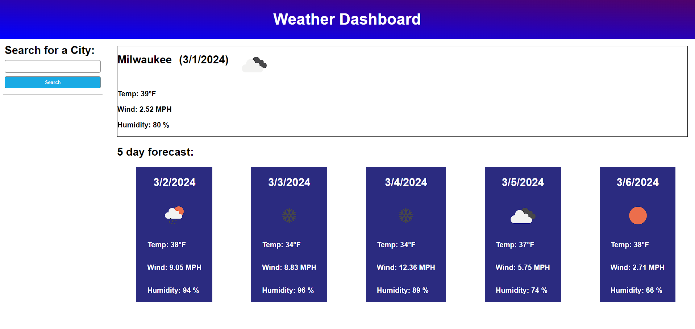
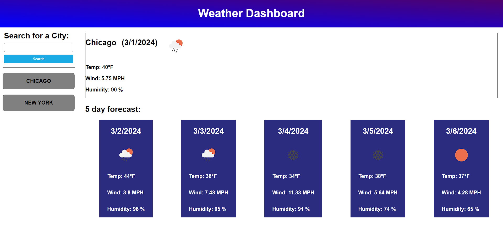

# 
 <b> Weather Dashboard </b>

## Description

This Weather Dashboard provides a simple to use five day forecast for a specified city. Being able to see expected weather conditions such as temperature, humidity, wind speeds and expected weather conditions helps users to plan for trips, events, and much more by getting accurate climate information from <a href = 'https://openweathermap.org/'>Open Weather Map</a>. To learn more about Open Weather Map you can see their contributions in our [Credits](#credits) section.

## Installation

No instillation is required to use our Weather Dashboard. To access the site please head to: [https://aranosbanazir.github.io/weather-forecast/]('https://aranosbanazir.github.io/weather-forecast/')

## Usage

To begin using the page you must first fill out what city you would like to see the forecast for. After selecting a city the information will display in the form of current weather data and a five day forecast, as depicted below.

After entering a city name, you will see it appear below the search bar as tracked search history for previously selected cities. Clicking on the search history item will repopulate the dashboard with updated information for that city.

Information on previously searched cities will remain stored in the browser between sessions allowing for quick access to a citys forecast.

## Credits
A special thanks to <a href = 'https://openweathermap.org/'>Open Weather Map</a> who provided access to their API which allowed us to present the gathered weather information.

